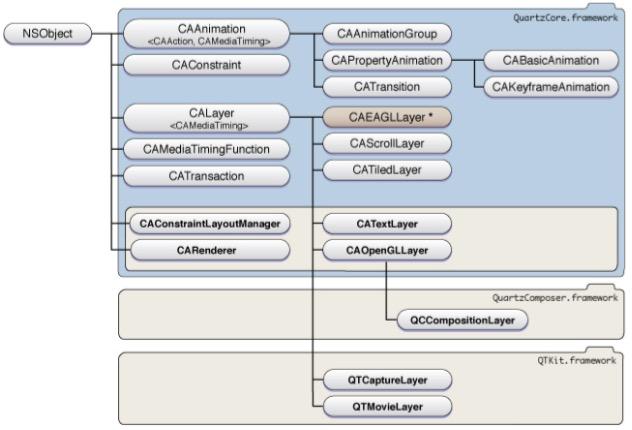
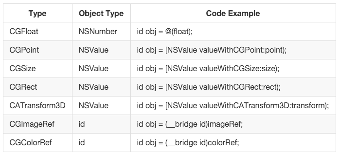

#### 按照鄙人一贯风格，废话不多说，进入正题。本文是对iOS动画基础知识的总结，以便以后查阅，有不对的地方，敬请指正。

#### iOS动画的实现依赖于`Core Animation`，Apple的官方文档地址[Core Animation Guide](https://developer.apple.com/library/ios/documentation/Cocoa/Conceptual/CoreAnimation_guide/Introduction/Introduction.html)

#### `Core Animation`是iOS和OS X平台上负责图形渲染与动画的基础框架。具体为何物，相信看官已经有了一个感性的认识，具体Google之。iOS平台上的动画分为隐式动画和显式动画。`Core Animation`基于一个假设:屏幕上的任何东西都可以（可能）做动画。动画并不需要你在`Core Animation`中手动打开，相反需要明确地关闭，否则他会一直存在。

#### 隐式动画

##### 隐式动画的意思是说我们并没有指定任何动画的类型。我们仅仅改变了一个属性，然后`Core Animation`来决定如何并且何时去做动画。 但当你改变一个属性，`Core Animation`是如何判断动画类型和持续时间的呢？实际上动画执行的时间取决于当前***事务(CATransaction)***的设置，动画类型取决于***图层行为***。隐式动画的默认`duration`为0.25s。简而言之，任何在一次`run loop`循环中属性的改变都会被集中起来，然后做一次0.25s的动画。 我们直接改变`CALayer`的可动画属性，会有隐式动画的效果，但是改变`UIView`的对应属性就没有隐式动画的效果，因为`UIView`将关联的图层的动画禁用了。想在`UIView`上做动画，只能用显示动画 或者 用其他方式打开禁用。

##### 关于隐式动画，就简单的讲这么多，我们的重点是在显式动画上。

#### 显式动画

##### `Core Animation`类及常用属性

##### `Core Animation`的类图

##### 如类图所示，`Core Animation`遵守`CAMediaTiming`和`CAAction`协议。`CAAnimation`主要分为三类：动画组、属性动画和过渡动画，其中属性动画又分为基础动画和关键帧动画。

##### 各类常用属性
- `CAMediaTiming`：`CALayer`和`Core Animation`都实现了这个协议，它模拟了一个定时系统的层级，它的每个对象都描述了从父类对象到本地的时间值的映射。从父类时间线到本地转化的步骤见文档。
    * 宗旨：`Core Animation`的时间都是相对的，每个动画都有它自己描述的时间，可以独立地加速，延时或者偏移。记住这点，可以方便理解属性的含义。
    * `duration`：动画的持续时长，它可能和动画进行的真实`duration`不一样，这个依赖与superlayer的time space或者就是speed。默认值是0，但不真是0，只是一个默认值，动画真实`duration`是0.25s。
    * `beginTime`：对象相对父类对象的开始时间，即动画的开始时间，但是是相对于父类的时间成了。获取当前时间用`CACurrentMediaTime()`函数。常见场景：`animation group`，里面有多个动画时，`beginTime`就是其`parent object—animation group`开始时间的一个偏移。至于偏移量根据业务需求而定，但是一定要注意`animation group`内的所有动画要有一个共同的时间起点，不要每次都是获取当前时间再加上偏移量，否则容易出错。
    * `speed`：指定从父类时间空间到`receiver`的时间空间是怎样映射的。是一个时间的倍数，默认1.0，减少它会减慢图层/动画的时间，增加它会加快速度。如果2.0的速度，那么对于一个duration为1.0的动画，实际上在0.5秒的时候就已经完成了。
    * `timeOffset`：和`beginTime`类似，但是和增加beginTime导致的延迟动画不同，增加`timeOffset`只是让动画快进到某一点，例如，对于一个持续1秒的动画来说，设置timeOffset为0.5意味着动画将从一半的地方开始。
    * `autoreverses`：设置在每次间隔交替循环过程中自动回放。这个值设置为`TRUE`后动画会沿着原执行路径自动返回，这会加倍动画的实际执行时间。
    * `repeatCount`：动画重复次数，浮点型，即动画可以重复小数次。小数次的部分会压缩整个动画效果，举个例子，设置为0.5，那么整个动画过程仍然是完整的，但是整个动画的持续时间为原来实际执行时间的0.5倍，还有注意如果`autoreverses`设置为`TRUE`，小数次部分没有`autoreverses`效果；还有一点该属性与`duration`属性类似，0为默认值，设置为0时并不是重复0次，而是1次。想要动画重复次数无限，可以用系统的宏定义`INFINITY`、`HUGE_VALF`、`MAXFLOAT` 其中前两个是一样的。***到此***我们可以总结一个公式`动画实际执行时间 = duration * （int）repeatCount * (autoreverses ? 2 : 1) + duration * (repeatCount - (int)repeatCount)`
    * `repeatDuration`：这是除了`repeatCount`外创建重复动画的另一种方式。它让动画重复一个指定的时间，而不是指定次数。
    * `fillMode`：这个属性定义的是动画在活动时间之外的行为。这就涉及到模型图层和呈现图层了。如果不了解`layer`动画的这个两个图层的含义。简单的说这个属性的定义就是 动画开始之前和动画结束之后，被设置动画的属性的值到底是多少。这个属性就是用动画开始和结束的值填充开始之前和结束之后的时间，让动画保持开始之前那一帧，或者动画结束之后的那一帧。`fillMode`是一个`NSString`类型，可以接受如下四种常量：
        - kCAFillModeForwards：向前填充动画状态 
        - kCAFillModeBackwards：向后填充动画状态 
        - kCAFillModeBoth：向前向后填充动画状态
        - kCAFillModeRemoved：默认值，动画结束后显示模型图层的指定值。
        
        当不是默认值的时候，还需要设置`removeOnCompletion = NO`配合才能起到效果。但是需要自己在在不需要动画的时候把动画移除掉。
- `CAnimation`：核心动画基础类，为抽象类，不能直接使用，实现`CAMediaTiming`协议
    * `timingFunction`：调速功能属性，定义动画的步速。`CAMediaTimingFunction`类型，系统预定义的步速类型分为以下几种：
        - kCAMediaTimingFunctionLinear：线型步速，即匀速
        - kCAMediaTimingFunctionEaseIn：先慢后快（慢进快出）
        - kCAMediaTimingFunctionEaseOut：先快后慢（快进慢出）
        - kCAMediaTimingFunctionEaseInEaseOut：先慢后快再慢
        - kCAMediaTimingFunctionDefault：默认值，中间比较快
    * `delegate`：设置动画委托，有两个委托方法：
            
            - (void)animationDidStart:(CAAnimation *)anim;
            - (void)animationDidStop:(CAAnimation *)anim finished:(BOOL)flag;
            
    * `removedOnCompletion`：是否自动在动画结束时将动画从渲染树上移除，默认是`YES`
- `CAAnimationGroup`：动画组，将一些列动画组合到一起。
    * `animations`：`CAAnimation`数组类型，成员为其他类型的动画
- `CAPropertyAnimation`：属性动画，继承于`CAnimation`
    * `keyPath`：要做动画的的属性的`keyPath`，使用kvc匹配到`CALayer`的可动画属性
    
    ***注意：组动画的duration和组内的成员动画的duration不同时，若成员动画duration>组动画duration，则成员动画会在组动画的活动时间后截断不再执行后面的部分，反之，成员动画会在组动画的活动时间后继续执行。***
- `CABasicAnimation`：基础动画类，继承于`CAPropertyAnimation`，并增加了以下三个`id`类型的属性：
    * fromValue：要设置的`keyPath`属性对应的动画开始之前属性的值
    * toValue：要设置的`keyPath`属性对应的动画结束之后的值 
    * byValue：：要设置的`keyPath`属性对应的动画执行过程中改变的值
    
    三个属性的取值如下表，需要注意的是，三个属性使用时组合方式有很多种，但是不能同时使用三个属性，否则会有冲突。
    
- `CAKeyframeAnimation`：关键帧动画
    * `values`：对象数组，提供每一个关键帧的属性数据。在数组赋值的时候，如果要考虑好的平滑过渡效果，需要将数组中第一个对象和最后一个对象设置为动画开始之前和动画结束后模型图层的属性值。这是因为`CAKeyframeAnimation`并不能自动把当前值作为第一帧，这样动画开始和结束后会有突然跳帧突变的效果。
    * `path`：关键帧动画的执行路径，优先级要高于`values`，当设置此属性时，`values`属性不再起作用。
    * `timingFunctions`：`CAMediaTimingFunction`类型数组，指定帧与帧之间过渡的步速。
- `CATransition`：过渡动画，前面的动画类型都是对可动画属性起作用，对不可动画属性做动画，就需要是用`CATransition`。
    * `type`：过渡动画的动画类型，系统提供了四种过渡动画：
        - kCATransitionFade 渐变效果
        - kCATransitionMoveIn 进入覆盖效果
        - kCATransitionPush 推出效果
        - kCATransitionReveal 揭露离开效果
    * `subtype`：过渡动画的动画方向，系统提供四个方向：
        - kCATransitionFromRight 从右侧进入
        - kCATransitionFromLeft 从左侧进入
        - kCATransitionFromTop 从顶部进入
        - kCATransitionFromBottom 从底部进入
    * `startProgress`：动画开始点，取值范围[0,1]
    * `endProgress`：动画结束点,取值范围[0,1]
    
#### 动画的三种实现方式

##### 一：`UIView`层的方法调用，长相大概是下面这样子

[UIView animateWithDuration:1.0f animations:^{
    // TODO ... 可动画属性设置
} completion:^(BOOL finished) {
    // TODO ... 可动画属性的动画结束后的值
}];


##### 二：`UIView`层的方法调用，`[begin commit]`模式，长相大概是下面这样子

[UIView beginAnimations:nil context:nil];
[UIView setAnimationDuration:1.0f];  // 注意[UIView setAnimation***]这些方法一定要写在可动画属性设置的前面，写在后面，设置不一定有效果，自己可以try一下
    // TODO ... 可动画属性设置
[UIView commitAnimations];


##### 三：`CALayer`层的方法调用，使用`Core Animation`中的子类，长相大概是下面这样子

CABasicAnimation *anima = [CABasicAnimation animationWithKeyPath:@"position"];
anima.fromValue = [NSValue valueWithCGPoint:CGPointMake(x, y)];
anima.toValue = [NSValue valueWithCGPoint:CGPointMake(x, y)];
anima.duration = 2.0f;
[someView.layer addAnimation:anima forKey:@"positionAnimation"];


##### 需要注意的是 在使用`frame`，`Autolayout（指apple原生约束方式）`，`Masonry`这三种常见方式布局的时候，实现位移、缩放等动画的方式也略有不同。使用约束布局的view做动画相对简单，只需要改变目标view的属性 关联的view会自动有动画效果，而使用frame布局时，需要将所有关联view的相应属性都做改变。

##### 还有就是为了平滑过渡，无论使用那种动画方式都要设置好模型图层即动画开始和结束之后的属性值，否则会有跳帧突然回到初始状态的现象。

#### 三种动画实现方式对`frame`，`Autolayout（指apple原生约束方式）`，`Masonry`的适用

##### 对于frame布局的view，大可以按照以前的方法去做。而使用约束方式布局的view因为设置的约束多样，同一个布局效果可能有多种设置约束的方式，而且实现一些效果时修改相应的约束很难（尤其是约束用masonry写的时候，哪位大神精通这一块，请不吝赐教），所以在做位移、缩放等几何动画时，对`UIView`建议使用`CGAffineTransform transform`仿射变换属性、`CALayer`建议使用`CATransform3D transform`属性。这些知识可以看一下扩展阅读中的内容。这里就不重复了。
    
#### NOTE！

##### 在使用委托方法时，先VC中把动画保存为一个属性，然后在委托方法中比较判断，这不起作用，因为委托方法中传入的`animation`参数是原始值的一个`deep copy`。 在委托方法中判断`animation`的正确姿势是`kvc & Dictionary`, `CAAnimation`遵守`kvc`协议，它的设计像一个`NSDictionary`，所以我们可以用`-setValue:forKey:`和`-valueForKey:`方法设置一个`标识tag`，根据这个tag去判断就好了，还可以做很多其他的工作奥，比如传递`animaiton`所属的VC，使用很灵活。

姿势示范：怎样在委托方法中区分多个动画
- (void)animationDidStop:(CAAnimation *)anim finished:(BOOL)flag
{
    // 错误打开方式，永远不会执行
    if (anim == self.anim) {
        //TODO:
    }
}
- (void)animationDidStop:(CAAnimation *)anim finished:(BOOL)flag
{
    // 正确的打开方式
    if ([anim valueForKey:@"key"] isEqualToString:@"anim") { // key-anim 键值对是初始化动画时设置好的
        //TODO:
    }
}


> 扩展延伸阅读
>
> [Masonry基础使用](http://xiongzenghuidegithub.github.io/blog/2015/08/11/masonryji-chu-shi-yong/)
>
> [CATransform3D的基本属性](http://www.jianshu.com/p/44080eec7a1c)